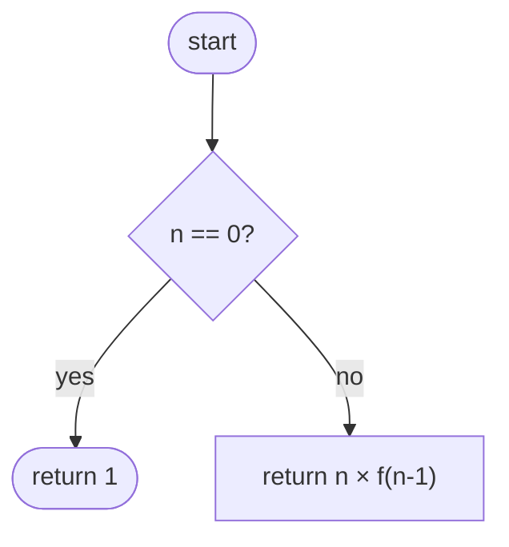

# slidev-theme-cyberpunk-ide

[](https://www.npmjs.com/package/slidev-theme-cyberpunk-ide)

A cyberpunk IDE-style theme for [Slidev](https://github.com/slidevjs/slidev), designed for teaching computer science. Each slide looks like a file open in a dark IDE, complete with title bar, tab bar, and status bar.

## Claude Code skill

A Claude Code skill is included to help you write slides with this theme. When installed, invoke it with `/cyberpunk-ide` at the start of any session to give Claude full context about layouts, frontmatter, callouts, and content density rules.

**Install:**

```bash
curl -fsSL -o ~/.claude/skills/cyberpunk-ide.md \
  https://raw.githubusercontent.com/marcofarina/slidev-theme-cyberpunk-ide/main/skill/cyberpunk-ide.md
```

Then in any Claude Code session working on a presentation:

```
/cyberpunk-ide
```

## Install

Add the following frontmatter to your `slides.md`:

```yaml
---
theme: cyberpunk-ide
---
```

## Fonts

The theme uses **Monaspace Neon** (body and code) and **Monaspace Radon** (comments in code blocks). Both variable fonts are bundled with the theme — no manual download or configuration required. They are licensed under the [SIL Open Font License 1.1](public/fonts/LICENSE).

## Layouts

### `cover` (default for slide 1)

Title slide with a cyberpunk grid background, scan lines, and an animated gradient on the heading.

```yaml
---
layout: cover
---

# Course Title

Subtitle or description
```

**Optional named slots:**

| Slot             | Position     | Purpose                    |
| ---------------- | ------------ | -------------------------- |
| `::logo::`       | Top-left     | School or institution logo |
| `::logo-right::` | Top-right    | Department or course logo  |
| `::sponsors::`   | Bottom strip | Sponsor / partner logos    |

The top bar is only rendered if at least one of `logo` or `logo-right` is provided. The sponsors strip is only rendered if `sponsors` is provided.

```markdown
---
layout: cover
---

# Course Title

Subtitle

::logo::


::logo-right::


::sponsors::


```

Images are automatically constrained (`max-height: 44px` for logos, `28px` for sponsors). Place image files in your presentation's `public/` folder and reference them with a leading `/`.

### `default`

Standard content slide wrapped in the IDE (title bar, tab bar, editor area, status bar).

```yaml
---
filename: recursion.py    # tab name and title bar — default: main.py
language: Python          # status bar right — default: Python
branch: recursion/base-case  # status bar left — default: main
repo: cs-course           # status bar left (repo name) — default: cyberpunk-ide
---

# Slide title
```

**`filename`** should be unique across all slides and descriptive of the content — the tab bar doubles as a navigation index for the presenter.

**`branch`** should read as a content breadcrumb in the form `topic/subtopic` (e.g. `recursion/base-case`, `sorting/bubble-sort`). Avoid numeric prefixes — they convey order, not meaning.

### `section`

Full-screen section divider with a grid background and a glowing accent line.

```yaml
---
layout: section
section: Module 2        # label shown above the title — default: Modulo
---

# *Chapter* Title
```

Wrap a word in `*...*` (em) to apply the neon purple accent color.

### `two-columns`

Splits the editor area into two panels separated by a neon vertical line. The title spans the full width above both panels.

```yaml
---
layout: two-columns
cols: 1-3             # panel proportions — see table below
filename: sorting.py
language: Python
branch: sorting/bubble-sort
repo: cs-course
---

# Slide title

::left::

Left panel content (text, bullets, callouts…)

::right::

Right panel content (code, diagram, image…)
```

| `cols` | Split   | Typical use |
| ------ | ------- | ----------- |
| `1-3`  | 25 / 75 | Short note + long code block |
| `2-2`  | 50 / 50 | Text and code of similar length |
| `3-1`  | 75 / 25 | Code + small diagram or flowchart |

### `center`

IDE chrome with content centred vertically in the editor area. Useful for diagrams, flowcharts, or a single focused element.

```yaml
---
layout: center
title: Optional heading     # renders as h1 above the centred area
filename: diagram.py
language: Python
branch: sorting/overview
repo: cs-course
---


```

### `end`

Full-screen closing slide. Mirrors the `cover` layout aesthetically — grid background, scan lines, animated gradient on `h1`, corner brackets in the opposite corners.

```yaml
---
layout: end
---

# Thanks!

Questions, feedback, contributions?

::footer::
github.com/your-org/your-repo
```

The optional `::footer::` slot renders a bottom strip (with a blinking cursor) — suitable for a URL, contact info, or a sign-off line.

### `fact`

Full-screen statement slide for a single big number or short claim. The `h1` is rendered at ~5 rem with the animated gradient.

```yaml
---
layout: fact
fact: complexity          # eyebrow label — default: fact
---

# O(n log n)

::source::
Lower bound for comparison-based sorting.
```

The optional `::source::` slot renders a smaller italic line below the statement — suitable for attribution or a one-line explanation.

### `image`

Full-screen background image with optional text overlay.

```yaml
---
layout: image
image: /path/to/photo.jpg       # required — URL or path relative to public/
backgroundSize: cover           # CSS background-size — default: cover
backgroundPosition: center      # CSS background-position — default: center
dim: 55                         # overlay darkness 0–100 — default: 50
---

# Optional heading

Optional subtitle or caption.
```

### `image-left` / `image-right`

Splits the IDE editor area into an image panel and a content panel. `image-left` places the image on the left; `image-right` places it on the right.

```yaml
---
layout: image-left
image: /path/to/photo.jpg
backgroundSize: cover
backgroundPosition: center
cols: 2-3               # image-width / content-width — default: 2-3 (40/60)
filename: example.py
language: Python
branch: topic/subtopic
repo: cs-course
---

Content goes in the default slot (right panel).
```

For `image-right`, the ratio still reads left-to-right (content / image), so `cols: 3-2` gives 60 % content on the left and 40 % image on the right. The default is `3-2`.

| `cols` | image-left split | image-right split |
| ------ | ---------------- | ----------------- |
| `1-2`  | 33 / 67          | 67 / 33           |
| `2-3`  | 40 / 60 *(default image-left)* | 60 / 40 |
| `1-1`  | 50 / 50          | 50 / 50           |
| `3-2`  | 60 / 40          | 40 / 60 *(default image-right)* |
| `2-1`  | 67 / 33          | 33 / 67           |

### `quote`

Full-screen citation slide styled as a multi-line block comment (`/* ... */`) rendered in Monaspace Radon.

```yaml
---
layout: quote
---

Any fool can write code that a computer can understand.
Good programmers write code that *humans* can understand.

::author::
Martin Fowler
```

The optional `::author::` slot renders the attribution right-aligned below the block.

### `diff`

IDE chrome with a unified diff view. Write a fenced code block with `lang="diff"` — lines prefixed with `-` are highlighted red, `+` green, and ` ` (space) are context lines.

```yaml
---
layout: diff
filename: sort.py           # default: changes.diff
language: Python            # default: Diff
branch: refactor/sorting
repo: cs-course
---

# Sorting — O(n²) → O(n log n)

```diff
 def sort(arr: list) -> list:
-    n = len(arr)
-    for i in range(n):
-        for j in range(n - i - 1):
-            if arr[j] > arr[j + 1]:
-                arr[j], arr[j + 1] = arr[j + 1], arr[j]
+    arr.sort()
     return arr
```
```

### `full`

Edge-to-edge canvas with no IDE chrome, no grid, and no padding. Use it for large Mermaid diagrams, iframes, custom HTML, or anything that needs total control of the slide area.

```yaml
---
layout: full
---

<div style="width:100%; height:100%; display:flex; align-items:center; justify-content:center;">
  <!-- your content -->
</div>
```

## Transitions

The theme defaults to **`transition: fade`** for all slides. Fade works particularly well at the boundary between IDE slides (`default`, `two-columns`) and full-screen slides (`cover`, `section`), where the chrome appears and disappears. Between two consecutive IDE slides the effect is subtle — the content fades while the chrome visually stays put.

To disable transitions for the entire presentation:

```yaml
---
# in the presentation headmatter (first slide)
transition: none
---
```

To override a single slide:

```yaml
---
transition: none   # or any other Slidev transition name
---
```

## Tab bar

The tab bar shows one chip-style tab per slide, auto-scrolling to keep the active one visible. Clicking any tab navigates to that slide.

### Hiding slides from the tab bar

By default, slides with an ambient layout (no IDE chrome) are **hidden** from the tab bar: `cover`, `section`, `end`, `fact`, `image`, `quote`, and `full`.

To **show all slides** including cover and section slides:

```yaml
---
# in the presentation headmatter (first slide)
themeConfig:
  tabsShowAll: true
---
```

To **hide a specific slide** from the tab bar regardless of the global setting:

```yaml
---
hideTab: true
---
```

## Status bar

| Position | Content                          | Frontmatter key | Default                     |
| -------- | -------------------------------- | --------------- | --------------------------- |
| Left     | Repo name (GitHub icon)          | `repo`          | `cyberpunk-ide`             |
| Left     | Branch / topic (git branch icon) | `branch`        | `main`                      |
| Right    | Language                         | `language`      | `Python`                    |
| Right    | Encoding                         | —               | `UTF-8` (fixed)             |
| Right    | Slide counter                    | —               | `current / total` (dynamic) |

## Line numbers

Line numbers are **enabled by default** by the theme. The scope of control is:

| Level                            | How                                |
| -------------------------------- | ---------------------------------- |
| Whole presentation (disable)     | `lineNumbers: false` in headmatter |
| Single code block (disable)      | ` ```python {lineNumbers:false} `  |
| Single code block (custom start) | ` ```python {startLine:10} `       |

## Syntax highlighting

Code blocks use the **Tokyo Night** theme via Shiki. Comment tokens are automatically rendered in **Monaspace Radon** (cursive/calligraphic style) to visually distinguish them from code.

## Callouts

Six callout types are available for highlighting definitions, tips, warnings, and learning objectives.

```markdown
:::definition Definition
An **algorithm** is a finite sequence of unambiguous instructions.
:::

:::info Useful Information
You can use `len()` to get the length of any sequence.
:::

:::warning Warning
Do not modify a list while iterating over it.
:::

:::clean Clean Code
Use descriptive names: `number_of_students` is better than `n`.
:::

:::code Python Syntax
`for item in list:` iterates without using indices.
:::

:::learn What You Will Learn
In this module you will see **recursion** in action.
:::
```

| Type         | Color      | Use for                      |
| ------------ | ---------- | ---------------------------- |
| `definition` | brown      | Formal definitions           |
| `info`       | amber      | Tips and notes               |
| `warning`    | red        | Pitfalls and gotchas         |
| `clean`      | light blue | Best practices / clean code  |
| `code`       | grey-blue  | Syntax reminders / code tips |
| `learn`      | pink-violet| Learning objectives          |

> **Incompatible with `mdc: true`.** MDC and `markdown-it-container` both use the `:::` block syntax and conflict with each other. The theme sets `mdc: false` by default — do not override it if you use callouts.

**Custom icon and color** — each callout accepts optional `icon` and `color` props to override the preset:

```markdown
<Callout type="info" title="Nota" icon="i-ph-star" color="#9ece6a">

Custom icon (any UnoCSS / Phosphor icon class) and hex color.

</Callout>
```

> Icons used by the presets (`paper.png`, `bulb.png`, etc.) must be present in `public/callouts/` of the presentation folder.

## Glossary tooltips

Add a `glossary` map to a slide's frontmatter to automatically wrap matching terms with interactive tooltips. Hovering (or focusing) the term shows its definition inline.

```yaml
---
filename: recursion.py
glossary:
  algorithm: A finite sequence of **unambiguous** instructions that solves a problem
  recursion: A technique where a function calls `itself` to solve sub-problems
  base case: The condition that stops the recursion, preventing a stack overflow
---
```

Definitions support inline formatting: `**bold**`, `*italic*`, `` `code` ``.

Terms inside fenced code blocks and inline code spans are left untouched.