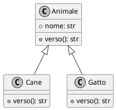

# Algoritmi e *Strutture Dati*

Benvenuti nel corso di Informatica — Anno 2140

<div style="margin-top: 8px; font-size: 0.8rem; color: #565f89">
  Prof. Marco Farina &nbsp;·&nbsp; Classe 4A Informatica &nbsp;·&nbsp; A.S. 2025/26
</div>

<!-- Slot opzionali — decommentare per usarli

::logo::


::logo-right::


::sponsors::


-->

---
filename: variabili.py
language: Python
repo: informatica-4BI
branch: 01-basi/variabili
---

# Variabili e Tipi

In Python ogni variabile ha un **tipo** che determina come vengono trattati i dati.

| Tipo | Esempio | Descrizione |
|------|---------|-------------|
| `int` | `42` | Numero intero |
| `float` | `3.14` | Numero decimale |
| `str` | `"ciao"` | Stringa di testo |
| `bool` | `True` | Valore booleano |

```python
nome: str   = "Alice"
eta: int    = 17
media: float = 8.5
promosso: bool = media >= 6
```

---
filename: funzioni.py
language: Python
repo: informatica-4BI
branch: 01-basi/funzioni
---

# Funzioni

Una **funzione** è un blocco di codice riutilizzabile. Definirla in Python è semplice:

```python
def saluta(nome: str) -> str:
    """Restituisce un saluto personalizzato."""
    return f"Ciao, {nome}! 👋"

# Chiamata
messaggio = saluta("Alice")
print(messaggio)   # → "Ciao, Alice! 👋"
```

I vantaggi:
- Evita la **ripetizione** del codice (DRY — Don't Repeat Yourself)
- Rende il programma più **leggibile**
- Facilita il **testing** e il debug

---
layout: section
section: Modulo 2
---

# *Strutture* Dati

---
filename: liste.py
language: Python
repo: informatica-4BI
branch: 02-strutture/liste
---

# Liste

Le liste in Python sono sequenze **ordinate** e **mutabili**.

```python
studenti = ["Alice", "Bob", "Carlo"]

# Accesso per indice (parte da 0)
primo = studenti[0]      # → "Alice"
ultimo = studenti[-1]    # → "Carlo"

# Metodi utili
studenti.append("Diana")   # aggiunge in fondo
studenti.insert(1, "Eva")  # inserisce alla posizione 1
studenti.sort()             # ordina alfabeticamente

# Slicing
primi_due = studenti[0:2]  # ["Alice", "Bob"]
```

> **Nota:** Gli indici partono da `0`, non da `1`!

---
filename: dizionari.py
language: Python
repo: informatica-4BI
branch: 02-strutture/dizionari
---

# Dizionari

I dizionari memorizzano coppie **chiave → valore**.

```python
studente = {
    "nome":   "Alice",
    "eta":    17,
    "media":  8.5,
    "classe": "4BI"
}

# Lettura
print(studente["nome"])          # → "Alice"
print(studente.get("media", 0))  # → 8.5

# Aggiunta / modifica
studente["promosso"] = studente["media"] >= 6

# Iterazione
for chiave, valore in studente.items():
    print(f"{chiave}: {valore}")
```

---
filename: complessita.py
language: Python
repo: informatica-4BI
branch: 03-algoritmi/complessita
---

# Complessità Algoritmica

La **notazione Big-O** descrive come cresce il tempo di esecuzione al crescere dell'input *n*.

| Notazione | Nome | Esempio |
|-----------|------|---------|
| O(1) | Costante | Accesso a lista per indice |
| O(log n) | Logaritmica | Ricerca binaria |
| O(n) | Lineare | Scansione lista |
| O(n²) | Quadratica | Bubble sort |

```python
# O(n) — scansione lineare
def cerca(lista, target):
    for elemento in lista:       # n iterazioni
        if elemento == target:
            return True
    return False

# O(log n) — ricerca binaria (lista ordinata!)
def cerca_binaria(lista, target):
    sinistra, destra = 0, len(lista) - 1
    while sinistra <= destra:
        meta = (sinistra + destra) // 2
        if lista[meta] == target:    return True
        elif lista[meta] < target:   sinistra = meta + 1
        else:                        destra = meta - 1
    return False
```

---
filename: ricorsione.py
language: Python
repo: informatica-4BI
branch: 03-algoritmi/ricorsione
---

# Ricorsione

Una funzione **ricorsiva** si chiama da sola. Ha sempre:
- un **caso base** (che ferma la ricorsione)
- un **caso ricorsivo** (che avvicina al caso base)

```python
def fattoriale(n: int) -> int:
    # Caso base
    if n <= 1:
        return 1
    # Caso ricorsivo: n! = n × (n-1)!
    return n * fattoriale(n - 1)

# Traccia di esecuzione per n=4:
# fattoriale(4)
#   → 4 * fattoriale(3)
#        → 3 * fattoriale(2)
#             → 2 * fattoriale(1)
#                  → 1  ← caso base
```

---
filename: tooltip.md
language: Markdown
repo: informatica-4BI
branch: extra/tooltip
glossary:
  algoritmo: Sequenza finita di istruzioni **non ambigue** che risolve un problema
  ricorsione: Tecnica in cui una funzione chiama `se stessa` per risolvere sotto-problemi
  caso base: La condizione che ferma la ricorsione, evitando lo stack overflow
---

# Tooltip — Glossario per slide

In questa slide le parole **algoritmo**, **ricorsione** e **caso base** sono
nel glossario del frontmatter: passaci sopra con il mouse.

Un algoritmo ricorsivo deve sempre avere un caso base, altrimenti la
ricorsione non termina mai.

```python
def fattoriale(n):
    # caso base — non viene sostituito
    if n <= 1:
        return 1
    return n * fattoriale(n - 1)
```

---
filename: callout.md
language: Markdown
repo: informatica-4BI
branch: extra/callout
---

# Callout — Tutti i tipi

:::definition Definizione
Un **algoritmo** è una sequenza finita di istruzioni non ambigue che risolve un problema.
:::

:::info Informazione utile
Puoi usare `len()` per ottenere la lunghezza di qualsiasi sequenza in Python.
:::

:::warning Attenzione
Non modificare una lista mentre la stai iterando con un `for` — il comportamento è indefinito.
:::

:::clean Clean Code
Usa nomi di variabili descrittivi: `numero_studenti` è meglio di `n` o `x`.
:::

:::code Sintassi Python
La sintassi `for elemento in lista:` itera su tutti gli elementi senza usare indici.
:::

:::learn Cosa imparerai
In questo modulo vedrai come usare la **ricorsione** per risolvere problemi complessi in modo elegante.
:::

---
layout: section
section: Extra
---

# *Formule*, Diagrammi e UML

---
filename: formule.md
language: LaTeX
repo: informatica-4BI
branch: extra/latex
---

# Formule con LaTeX

Equazioni **inline**: la formula quadratica è $x = \dfrac{-b \pm \sqrt{b^2 - 4ac}}{2a}$

**Block equation** — serie di Taylor:

$$
f(x) = \sum_{n=0}^{\infty} \frac{f^{(n)}(a)}{n!}(x - a)^n
$$

Complessità e logaritmi:

$$
T(n) = 2\,T\!\left(\frac{n}{2}\right) + O(n) \implies T(n) = O(n \log n)
$$

Probabilità condizionata (Bayes):

$$
P(A \mid B) = \frac{P(B \mid A)\,P(A)}{P(B)}
$$

---
filename: diagramma.md
language: Mermaid
repo: informatica-4BI
branch: extra/mermaid
---

# Diagrammi con Mermaid


---
filename: uml.md
language: PlantUML
repo: informatica-4BI
branch: extra/plantuml
---

# Diagrammi con PlantUML



---
layout: section
section: Esercizi
---

# *Challenge* Time

---
filename: esercizio_01.py
language: Python
repo: informatica-4BI
branch: 04-esercizi/fizzbuzz
---

# Esercizio — FizzBuzz

Scrivi una funzione `fizzbuzz(n)` che restituisce una lista dove:
- i multipli di **3** → `"Fizz"`
- i multipli di **5** → `"Buzz"`
- i multipli di **entrambi** → `"FizzBuzz"`
- tutti gli altri → il numero stesso

```python
def fizzbuzz(n: int) -> list:
    risultato = []
    for i in range(1, n + 1):
        if i % 15 == 0:
            risultato.append("FizzBuzz")
        elif i % 3 == 0:
            risultato.append("Fizz")
        elif i % 5 == 0:
            risultato.append("Buzz")
        else:
            risultato.append(i)
    return risultato

# Test
print(fizzbuzz(15))
# [1, 2, "Fizz", 4, "Buzz", "Fizz", 7, 8,
#  "Fizz", "Buzz", 11, "Fizz", 13, 14, "FizzBuzz"]
```
