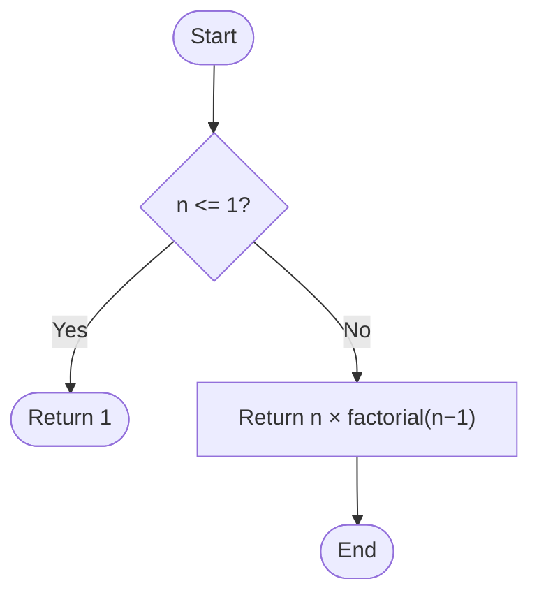
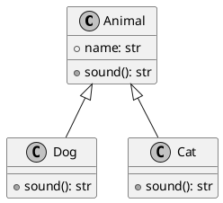
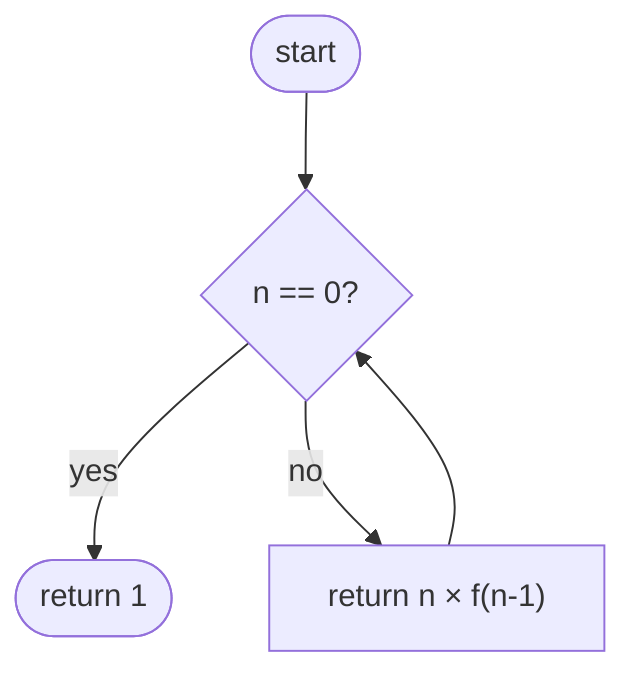

# Algorithms and *Data Structures*

Welcome to the Computer Science course — Year 2140

<div style="margin-top: 8px; font-size: 0.8rem; color: #565f89">
  Prof. Marco Farina &nbsp;·&nbsp; Class 4A CS &nbsp;·&nbsp; A.Y. 2025/26
</div>

<!-- Optional slots — uncomment to use

::logo::


::logo-right::


::sponsors::


-->

---
filename: variables.py
language: Python
repo: cs-examples
branch: 01-basics/variables
---

# Variables and Types

Tables are written in standard Markdown and rendered with the theme's styling. Each column can hold **inline code**, plain text, or any inline element.

| Type    | Example | Description    |
| ------- | ------- | -------------- |
| `int`   | `42`    | Integer number |
| `float` | `3.14`  | Decimal number |
| `str`   | `"hi"`  | Text string    |
| `bool`  | `True`  | Boolean value  |

```python
name: str    = "Alice"
age: int     = 17
grade: float = 8.5
passed: bool = grade >= 6
```

---
filename: functions.py
language: Python
repo: cs-examples
branch: 01-basics/functions
---

# Functions — Comment Font

Code **comments** and **docstrings** are rendered in a distinct font (Monaspace Radon) to visually separate them from executable code. All other tokens use Monaspace Neon.

```python
def greet(name: str) -> str:
    """Return a personalised greeting for the given name."""
    return f"Hello, {name}! 👋"

# Call the function and print the result
message = greet("Alice")
print(message)   # → "Hello, Alice! 👋"
```

The font switch is handled by a custom Shiki transformer that detects comment tokens by their Tokyo Night colour values and adds a `token-comment` CSS class.

---
layout: section
section: Module 2
---

# Data Structures

---
filename: lists.py
language: Python
repo: cs-examples
branch: 02-structures/lists
---

# Lists — Blockquote Note

A `>` blockquote in Markdown is rendered as a styled **note** highlighted at the bottom of the slide — useful for tips, reminders, or caveats.

```python
students = ["Alice", "Bob", "Carlo"]

# Index access (starts at 0)
first = students[0]      # → "Alice"
last  = students[-1]     # → "Carlo"

# Useful methods
students.append("Diana")   # add to the end
students.insert(1, "Eva")  # insert at position 1
students.sort()             # sort alphabetically

# Slicing
first_two = students[0:2]  # ["Alice", "Bob"]
```

> **Note:** Indices start at `0`, not `1`!

---
filename: tooltip.md
language: Markdown
repo: cs-examples
branch: extra/tooltip
glossary:
  algorithm: A finite sequence of **unambiguous** instructions that solves a problem
  recursion: A technique where a function calls `itself` to solve sub-problems
  base case: The condition that stops the recursion, preventing a stack overflow
---

# Tooltip — Slide Glossary

Add a `glossary` map to the slide frontmatter and any matching word in the slide body becomes a hoverable **tooltip**. Try hovering over **algorithm**, **recursion**, and **base case**.

```yaml
glossary:
  algorithm: A finite sequence of **unambiguous** instructions that solves a problem
  recursion: A technique where a function calls `itself` to solve sub-problems
  base case: The condition that stops the recursion, preventing a stack overflow
```

A recursive algorithm must always have a base case, otherwise the
recursion never terminates.

---
filename: callout.md
language: Markdown
repo: cs-examples
branch: extra/callout
---

# Callout — Informational Types

:::definition Definition
Use `:::definition Title` to highlight a formal definition. Rendered with a brown left border and a bold label above the content.
:::

:::info Info
Use `:::info Title` to surface a useful tip or background note. Rendered with an amber left border to draw the reader's attention.
:::

:::warning Warning
Use `:::warning Title` to flag something that could cause errors or unexpected behaviour. Rendered with a red left border so it stands out.
:::

---
filename: callout.md
language: Markdown
repo: cs-examples
branch: extra/callout
---

# Callout — Didactic Types

:::clean Clean Code
Use `:::clean Title` to highlight a best practice or style guideline. Rendered with a light blue left border to suggest a positive habit to build.
:::

:::code Code Syntax
Use `:::code Title` to call out a syntax rule or language feature. Rendered with a grey-blue left border, matching the IDE comment colour.
:::

:::learn What You'll Learn
Use `:::learn Title` to preview the learning goals of a module or section. Rendered with a pink-violet left border to frame the upcoming content.
:::

---
layout: section
section: Extra
---

# Formulas, Diagrams and UML

---
filename: formulas.md
language: LaTeX
repo: cs-examples
branch: extra/latex
---

# Formulas with LaTeX

**Inline** equation: the quadratic formula is $x = \dfrac{-b \pm \sqrt{b^2 - 4ac}}{2a}$

**Block equation** — Taylor series:

$$
f(x) = \sum_{n=0}^{\infty} \frac{f^{(n)}(a)}{n!}(x - a)^n
$$

Complexity and logarithms:

$$
T(n) = 2\,T\!\left(\frac{n}{2}\right) + O(n) \implies T(n) = O(n \log n)
$$

Conditional probability (Bayes):

$$
P(A \mid B) = \frac{P(B \mid A)\,P(A)}{P(B)}
$$

---
filename: diagram.md
language: Mermaid
repo: cs-examples
branch: extra/mermaid
---

# Diagrams with Mermaid



---
filename: uml.md
language: PlantUML
repo: cs-examples
branch: extra/plantuml
---

# Diagrams with PlantUML



---
layout: two-columns
cols: 1-3
filename: recursion.py
language: Python
branch: 03/recursion
repo: cs-examples
---

# Two-Column Layout — `cols: 1-3`

::left::

Use `layout: two-columns` in the frontmatter and place content after `::left::` and `::right::` slot markers. The `cols` property sets the width ratio — `1-3` gives a narrow left column and a wide right column.

```yaml
---
layout: two-columns
cols: 1-3
---
```

::right::

```python
def factorial(n: int) -> int:
    # Base case
    if n == 0:
        return 1

    # Recursive case
    return n * factorial(n - 1)


print(factorial(5))   # 120
print(factorial(0))   # 1
```

---
layout: two-columns
cols: 2-2
filename: recursion.py
language: Python
branch: 03/recursion
repo: cs-examples
---

# Two-Column Layout — `cols: 2-2`

::left::

`cols: 2-2` splits the slide into two **equal** columns. Any Markdown content — prose, lists, code blocks — can go in either slot.

```yaml
---
layout: two-columns
cols: 2-2
---
```

::right::

```python
def factorial(n: int, depth: int = 0) -> int:
    indent = "  " * depth
    print(f"{indent}factorial({n})")

    if n == 0:
        print(f"{indent}→ 1")
        return 1

    result = n * factorial(n - 1, depth + 1)
    print(f"{indent}→ {result}")
    return result

factorial(4)
```

---
layout: two-columns
cols: 3-1
filename: recursion.py
language: Python
branch: 03/recursion
repo: cs-examples
---

# Two-Column Layout — `cols: 3-1`

::left::

```python
def factorial(n: int) -> int:
    if n == 0:          # base case
        return 1
    return n * factorial(n - 1)
```

`cols: 3-1` gives a wide left column and a narrow right column — ideal for placing a diagram, legend, or short note alongside a large code block.

```yaml
---
layout: two-columns
cols: 3-1
---
```

::right::


