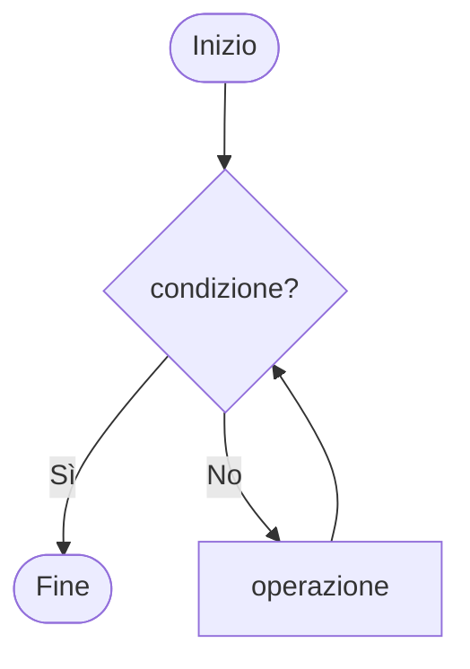

You are helping write or edit slides for a Slidev presentation that uses **slidev-theme-cyberpunk-ide** — a dark IDE-style theme designed for teaching computer science. Slides look like files open in a code editor (title bar, tab bar, editor area, status bar).

Apply every rule below when generating or editing slide content.

---

## LAYOUTS

### cover (title slide)
The first slide. No `layout:` needed — it is the default for the first slide.
Slots: `::logo::`, `::logo-right::`, `::sponsors::` (all optional).

```md
---
theme: slidev-theme-cyberpunk-ide
title: Corso di Informatica
---

# Titolo del *Corso*

Sottotitolo o descrizione breve
```

*Wrap words in `*italic*` inside `#` headings to render them in accent purple.*

---

### default (content slide)
Any slide without an explicit `layout:` uses this. It wraps content in the IDE chrome.

```md
---
filename: variabili.py
language: Python
branch: 01/variabili
repo: informatica-4BI
---

# Titolo della Slide

Contenuto...
```

---

### section (divider)
Used between modules. Full-screen, no IDE chrome. Shows a glowing accent line.

```md
---
layout: section
section: Modulo 2
---

# *Strutture* Dati
```

`section:` sets the eyebrow label above the title. Default: `Modulo`.

---

### two-columns (dual-panel)
Splits the editor area into two panels separated by a neon vertical line.
The title spans the full width above both panels.

```md
---
layout: two-columns
cols: 1-3
filename: ricorsione.py
language: Python
branch: 03/ricorsione
repo: informatica-4BI
---

# Titolo sopra entrambe le colonne

::left::

Contenuto pannello sinistro (testo, bullet, callout…)

::right::

Contenuto pannello destro (codice, diagramma, immagine…)
```

**`cols` values** (4 total units split by a 1px glowing divider):

| `cols` | Proporzione | Uso tipico |
|--------|-------------|------------|
| `1-3`  | 25% / 75%   | Breve nota + blocco codice lungo |
| `2-2`  | 50% / 50%   | Testo + codice comparabili |
| `3-1`  | 75% / 25%   | Codice + diagramma / flowchart piccolo |

---

## FRONTMATTER PER SLIDE

Every content slide (default and two-columns) accepts these props, which populate the IDE status bar and title bar:

| Prop | Default | Descrizione |
|------|---------|-------------|
| `filename` | `main.py` | Etichetta del tab e title bar |
| `language` | `Python` | Status bar destra |
| `branch` | `main` | Status bar sinistra |
| `repo` | `cyberpunk-ide` | Status bar sinistra |
| `hideTab: true` | — | Nasconde questa slide dalla tab bar |

**`filename` — unique and meaningful across all slides**
Every slide must have a distinct `filename`. The tab bar doubles as a navigation index for the presenter: meaningful, unique names let them jump to any slide at a glance. Bad: `main.py`, `slide2.py`. Good: `fattoriale.py`, `stack-ricorsione.py`, `bubble-sort.py`.

**`branch` — content outline, not a number**
Use the branch to trace the conceptual path of the presentation: `macroargomento/argomento-della-slide`. It should read like a breadcrumb. Examples: `ricorsione/caso-base`, `sorting/bubble-sort`, `oop/ereditarieta`. Avoid numeric prefixes like `03/ricorsione` — they convey order, not meaning.

---

## PROJECT SETUP

Every presentation using this theme requires a `vite.config.ts` in the project root to enable the callout syntax. Without it, `:::type Title` blocks render as plain text.

```ts
import { defineConfig } from 'vite'
import Container from 'markdown-it-container'

const calloutTypes = ['definition', 'info', 'warning', 'clean', 'code', 'learn']

export default defineConfig({
  slidev: {
    markdown: {
      markdownSetup(md: any) {
        for (const type of calloutTypes) {
          md.use(Container, type, {
            render(tokens: any[], idx: number) {
              const token = tokens[idx]
              if (token.nesting === 1) {
                const title = md.utils.escapeHtml(token.info.trim().slice(type.length).trim())
                return `<Callout type="${type}" title="${title}">\n`
              }
              return '</Callout>\n'
            },
          })
        }
      },
    },
  },
} as any)
```

Also install the dependency:

```bash
npm install -D markdown-it-container
```

If the user's project already has a `vite.config.ts`, merge this `slidev.markdown` block into it rather than replacing it.

---

## HEADMATTER OPTIONS (first slide frontmatter)

```yaml
theme: slidev-theme-cyberpunk-ide
transition: none      # REQUIRED — always set to none (see below)
themeConfig:
  tabsShowAll: true   # show cover/section slides in tab bar (default: false)
lineNumbers: false    # disable global line numbers (default: true)
```

**Transitions: always disabled.**
Never use slide transitions with this theme. The IDE chrome (title bar, tab bar, status bar) is a persistent frame — any animated transition between slides breaks the illusion of a stable editor and produces visual glitches. Set `transition: none` in the headmatter and never override it per-slide.

---

## CALLOUT COMPONENT

Use callouts to highlight definitions, tips, warnings, or learning goals. Prefer them over plain `> blockquotes`.

**Syntax:**
```
:::type Title
Content — supports **bold**, `code`, *italic*
:::
```

**Available types:**

| Type | Icon | Color | When to use |
|------|------|-------|-------------|
| `definition` | 📄 paper | brown | Formal definitions of terms |
| `info` | 💡 bulb | yellow | Tips, useful notes, shortcuts |
| `warning` | 🔥 fire | red | Common mistakes, dangerous patterns |
| `clean` | ✨ clean | cyan | Clean code practices, refactoring advice |
| `code` | `</>` code | gray | Syntax rules, language-specific notes |
| `learn` | 🧠 brain | purple | Learning objectives, "what you'll learn" |

**Example:**
```
:::definition Algoritmo
Una sequenza **finita** di istruzioni non ambigue che risolve un problema.
:::

:::warning Attenzione
Non modificare una lista mentre la stai iterando con `for`.
:::
```

**Density rule:** maximum one callout per slide on a default layout; maximum one per column on two-columns.

---

## TOOLTIP COMPONENT

Renders a hover tooltip for glossary terms. Define terms in the frontmatter and wrap them in `<Tooltip text="...">` in the content.

```md
---
glossary:
  ricorsione: Tecnica in cui una funzione chiama `se stessa`
  caso base: La condizione che ferma la ricorsione
---

Il **caso base** è essenziale in ogni funzione ricorsiva.
```

Tooltip renders automatically for words listed in `glossary:`. No explicit `<Tooltip>` tag needed for glossary terms.

---

## TEXT DENSITY GUIDELINES

The slide canvas is fixed — overflow is hidden. Follow these limits to avoid content being cut off.

### default layout
A slide is full when it contains **one** of these combinations:

- Title + 3–4 lines prose + code block of 10–14 lines
- Title + 3–4 lines prose + table (4–6 rows) + code block of 4–6 lines
- Title + bullet list (4–6 items) + code block of 8–12 lines
- Title + 2 callouts + code block of 6–8 lines
- Title + 3 callouts (no code)

**Never** put two code blocks on the same default slide.

### two-columns layout (after title)

| `cols` | Left panel | Right panel |
|--------|-----------|-------------|
| `1-3` | max 4–5 lines text, no code | code up to 14 lines OR a diagram |
| `2-2` | 5–8 lines text or short code (6–8 lines) | same |
| `3-1` | code (10–14 lines) + 2–3 lines prose | short diagram or 4–6 line code |

### Headings
- Use `#` (h1) for the slide title — **one per slide**.
- Use `##` or `###` sparingly inside content for sub-sections; avoid on short slides.
- Wrap key words in `*italic*` inside `#` to render them in accent purple.

### Lists
- Prefer 3–5 items. More than 6 items = split into two slides.
- Avoid nesting deeper than one level.

---

## DIAGRAMS

Use Mermaid for flowcharts and sequence diagrams. Add `{scale: 0.75}` (or lower) if the diagram is complex, to prevent overflow.

```

```

PlantUML is also available for UML class/sequence diagrams.

---

## WRITING STYLE

- **Language:** match the user's language (Italian for Italian courses, etc.)
- **Titles:** concise, 3–6 words. One key word in `*italic*` for visual emphasis.
- **Prose:** short sentences, active voice. Max 2 sentences before a list or code block.
- **Code blocks:** always specify the language (` ```python `, ` ```ts `, etc.). Include short inline comments on non-obvious lines.
- **Bold** key terms on first use. Do not bold whole sentences.
- `inline code` for any identifier, keyword, operator, or value.

---

## QUICK REFERENCE — SLIDE SKELETON

```md
---
filename: nome-significativo.py   # unico in tutta la presentazione
language: Python
branch: macroargomento/argomento  # es. ricorsione/caso-base
repo: nome-repo
---

# Titolo della *Slide*

Una frase introduttiva breve.

- Punto chiave uno
- Punto chiave due
- Punto chiave tre

```python
# Esempio di codice
def esempio():
    return 42
```

:::info Nota
Un dettaglio utile da ricordare.
:::
```
